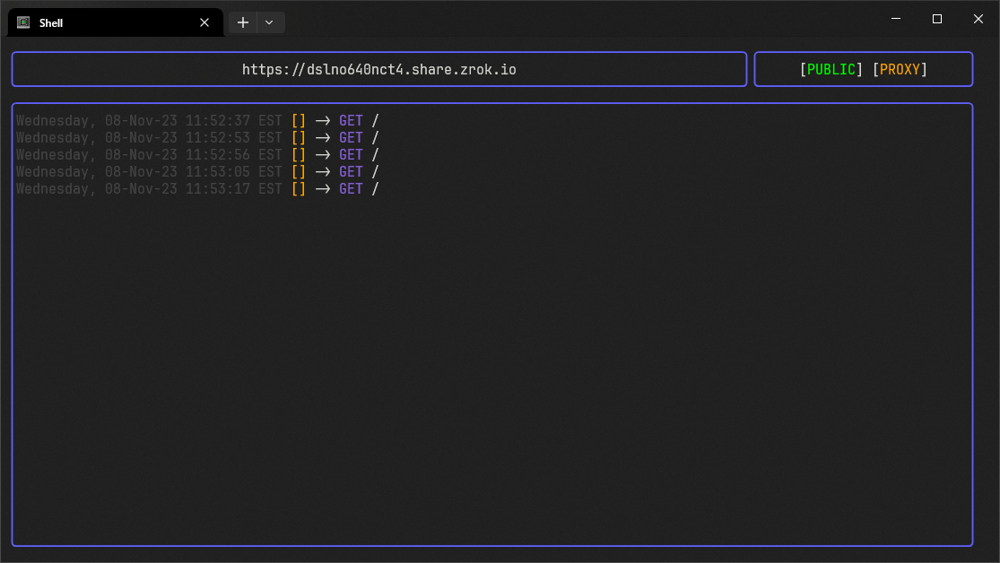
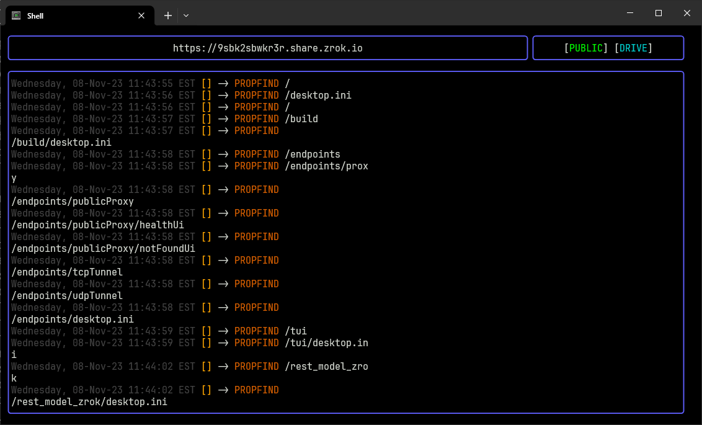
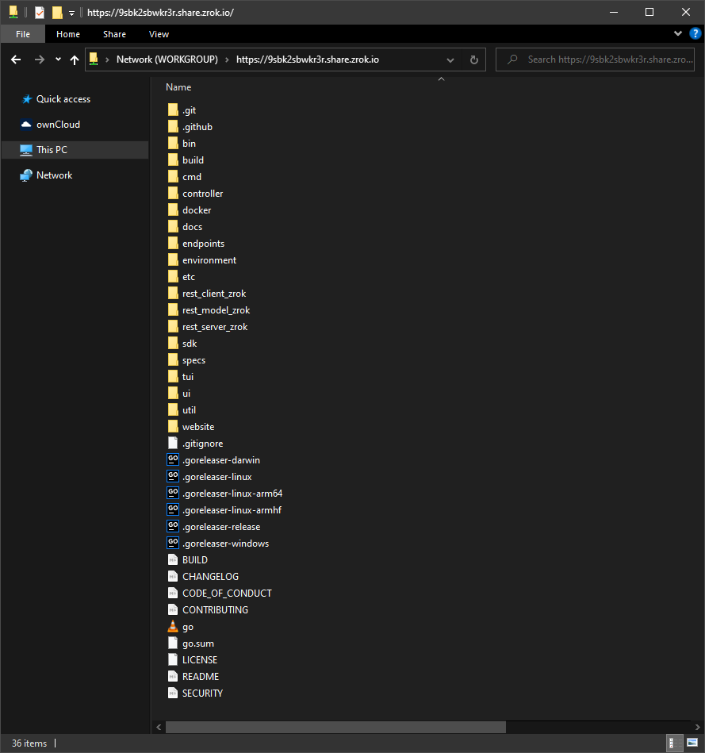

`zrok` is a next-generation, peer-to-peer sharing platform built on top of [OpenZiti](https://docs.openziti.io/docs/learn/introduction/), a programmable zero-trust network overlay. `zrok` is a _Ziti Native Application_.

`zrok` facilitates sharing resources both publicly and privately. Public sharing allows you to share `zrok` resources with non-`zrok` users over the public internet. Private sharing allows you to directly share your resources peer-to-peer with other `zrok` users without changing your security or firewall settings.

Like other offerings in this space, `zrok` allows users to share tunnels for HTTP, TCP and UDP network resources. `zrok` additionally allows users to easily and rapidly share files, web content, and custom resources in a peer-to-peer manner.

`zrok` is an extensible platform for sharing. Initially we're targeting technical users. Super-simple sharing for end users is planned and in the backlog.


## Frictionless

You can be up and sharing using the `zrok.io` service in minutes. Here is a synopsis of what's involved:

* Download the binary for your platform [here](https://github.com/openziti/zrok/releases/latest)
* `zrok invite` to create an account with the service
* `zrok enable` to enable your shell environment for sharing with the service

### And then... sharing...

Easily share private network resources with public internet users, securely, without having to alter any of your local network configuration:

```
$ zrok share public localhost:8080
```



```
$ curl -s https://dslno640nct4.share.zrok.io | head
<!DOCTYPE html>
<html lang="en">
<head>
    <meta charset="utf-8"/>
    <meta name="viewport" content="width=device-width, initial-scale=1"/>
    <meta name="theme-color" content="#000000"/>
    <meta name="description" content="zrok ui"/>
    <link rel="preconnect" href="https://fonts.googleapis.com">
```

Share "network drives" with public and private users running on Windows, macOS, or Linux systems:

```
$ zrok share public --backend-mode drive ~/Repos/zrok
```



Mounting and working with shared drives is simple, and works with any applications on the end users' systems:



See the [Concepts and Getting Started Guide](https://docs.zrok.io/docs/getting-started) for a full overview.

## The `zrok` SDK

`zrok` includes an SDK that allows you to embed `zrok` sharing capabilities into your own applications. If you're familiar with a golang `net.Conn` and `net.Listener`, you'll be right at home with our SDK.

### A Simple `zrok` Sharing Service

```go
// load enabled zrok environment
root, err := environment.LoadRoot()

// request a share for your resource
shr, err := sdk.CreateShare(root, &sdk.ShareRequest{
    BackendMode: sdk.TcpTunnelBackendMode,
    ShareMode:   sdk.PrivateShareMode,
	// ...
})

// accept requests for your resource
listener, err := sdk.NewListener(shr.Token, root)
```

### A Simple `zrok` Client

```go
// load enabled zrok environment
root, err := environment.LoadRoot()

// request access to a shared zrok resource
acc, err := sdk.CreateAccess(root, &sdk.AccessRequest{ShareToken: shrToken})

// establish a connection to the resource directly
conn, err := sdk.NewDialer(shrToken, root)
```

This [blog post](https://blog.openziti.io/the-zrok-sdk) provides more details for [getting started](https://blog.openziti.io/the-zrok-sdk) with the `zrok` SDK.

## Self-Hosting

`zrok` is designed to scale up to support extremely large service instances. `zrok.io` is a public service instance operated by NetFoundry using the same code base that is available to self-hosted environments.

`zrok` is also designed to scale down to support extremely small deployments. Run `zrok` and OpenZiti on a Raspberry Pi!

The single `zrok` binary contains everything you need to operate `zrok` environments and also host your own service instances. Just add an OpenZiti network and you're up and running.

See the [Self-Hosting Guide](https://docs.zrok.io/docs/guides/self-hosting/self_hosting_guide/) for details on getting your own `zrok` service instance running.

## zrok Office Hours

We maintain a growing playlist of videos focusing on various aspects of `zrok`. This includes the "office hours" series, which are longer-format videos digging into the implementation of `zrok` and showcasing some of the latest features and capabilities:

[](https://www.youtube.com/watch?v=Edqv7yRmXb0&list=PLMUj_5fklasLuM6XiCNqwAFBuZD1t2lO2)


## Building

If you are interested in building `zrok` for yourself instead of using a released package, please refer to [BUILD.md](./BUILD.md)

## Contributing

If you'd like to contribute back to `zrok`, that'd be great. Please see our [CONTRIBUTING.md](./CONTRIBUTING.md) page and
abide by the [CODE_OF_CONDUCT.md](./CODE_OF_CONDUCT.md).
